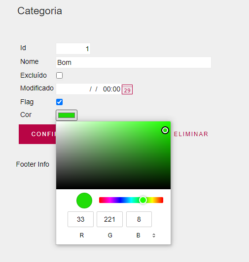

# Genexus Color Picker
User control para seletor de cor. Faz uso do _input type=color_ padrão do _HTML5_.

## Instalação
Importar o arquivo _UcColorPicker.xpz_ na KB.
    Menu Knowledge Manager -> Import -> selecionar o arquivo _.xpz_

## Exemplo de uso
1) Adicionar o _UserControl_ _UcColorPicker_ no _WebForm_.
2) No evento Start atribuir a propriedade _InternalName_ de um atributo/variável à propriedade _GxControl_ do _UcColorPicker_.

```Gx
Event Start
    // CategoriaCor -> Varchar(10) vai armazenar valor no formato Hexadecimal. Ex: "#FF55AA"
    UcColorpicker1.GxControl = CategoriaCor.InternalName
EndEvent
```



## Meta
Gilmar J. A. Goulart – [@gilmargoulart](https://github.com/gilmargoulart)
