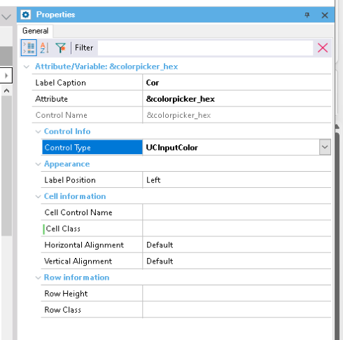

# Genexus Color Picker

User control para seletor de cor. Faz uso do _input type=color_ padrão do _HTML5_.

O valor da cor em Hexadecimal é gravado na variável/atributo.

## Instalação

Importar o arquivo _UcColorPicker.xpz_ na KB.

-> Menu Knowledge Manager -> Import -> selecionar o arquivo _.xpz_

## Exemplo de uso

1) Adicionar variável do tipo varchar(10).
2) Alterar a propriedade "Control Type" da variável para "UCInputColor".

## Meta

Gilmar J. A. Goulart – [@gilmargoulart](https://github.com/gilmargoulart)
